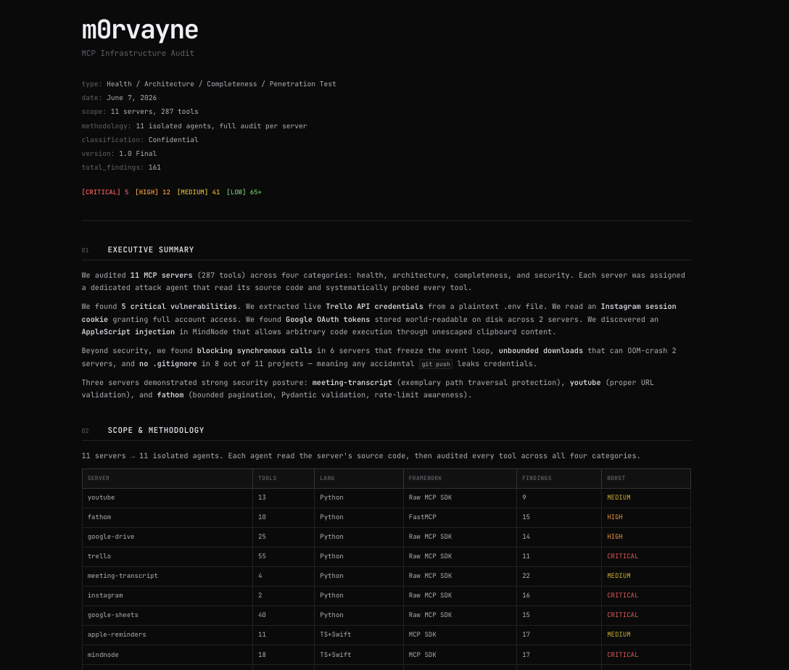

<div align="center">

# mcp-redteam

**It doesn't tell you where your walls are thin. It walks through them.**

[](LICENSE)
[](https://owasp.org/www-project-mcp-top-10/)
[](https://claude.ai/code)

</div>

---

A Claude Code plugin that audits and penetration-tests your MCP servers. Reads source code, probes every tool, finds what's broken — and shows you how to fix it.

Not a static scanner. Not a config checker. An active red team that isolates each server, attacks it across four categories, and generates an interactive HTML report with proven findings.

## Install

```bash
claude plugin marketplace add m0rvayne/mcp-redteam
claude plugin install mcp-redteam
```

Works globally — run from any project:

```
/mcp-redteam
```

No dependencies. No API keys. No build step. The marketplace is added once — future updates are just `claude plugin update mcp-redteam`.

## What happens when you run it

1. **Discovery** — finds all your connected MCP servers
2. **Isolation** — spawns one dedicated agent per server (10 servers = 10 agents)
3. **Source analysis** — each agent reads the server's source code
4. **Attack** — systematically tests every tool against every applicable vulnerability
5. **Report** — generates an interactive HTML report with findings, evidence, and fixes
6. **Fix** — offers to apply fixes with your confirmation

## What it checks

Each server gets a full audit across four categories:

### Health

Signal handling, stdout pollution, blocking sync calls in async context, HTTP timeouts, subprocess timeouts, error containment, HTTP client lifecycle, venv integrity, graceful shutdown.

### Architecture

Code structure and modularity, tool count sanity (230 tools = red flag), dependency pinning, OAuth token lifecycle, error message content analysis, resource cleanup and disk growth, framework choice assessment.

### Completeness

API coverage gaps, input schema validation, .gitignore for secrets, credential file permissions, type safety, compile/syntax checks.

### Security

Path traversal with real payloads (`../../etc/passwd` and variants). SSRF probing (`169.254.169.254`, `file://`, localhost). Command injection testing (`;`, `|`, `` ` ``, `$()`). Credential storage audit (plaintext tokens, world-readable files). Error message analysis (does `str(e)` leak API keys?). Tool poisoning detection (hidden `<IMPORTANT>` tags, Unicode smuggling). Type confusion, resource exhaustion, cross-tool exfiltration chains.

Based on 40+ CVEs, OWASP MCP Top 10, and research from Invariant Labs, Trail of Bits, Palo Alto Unit 42, OX Security, and Snyk.

## What you get

<div align="center">

</div>

An interactive HTML report — not a PDF, not a dashboard. A document that opens in any browser, works on mobile, and lets you drill into each server:

- **Per-server breakdown** — click a server, see everything that's wrong with it
- **Proven findings** — "we wrote to ~/.bashrc via path traversal", not "may be vulnerable"
- **Risk score** — 0 to 100 per server, so you know where to start
- **Remediation roadmap** — prioritized fixes with exact code changes
- **Defended checks** — what your servers already do well (proves thoroughness)

Open `examples/sample-report.html` to see a real report from an audit of 11 MCP servers (161 findings, 5 critical).

## After the report

Say "fix it" and the plugin applies fixes — with your confirmation:

**Auto-fixable** — .gitignore, chmod 600, path validation, URL validation, error sanitization, asyncio.to_thread() wrappers, dependency pinning. Show → confirm → done.

**Requires your decision** — credential rotation (you need to regenerate keys), OAuth revoke, OS Keychain migration, PII redaction policy. The plugin explains the tradeoff and lets you decide.

**Can't fix automatically** — pip/npm-installed packages (fork instead), built-in Anthropic servers (report to Anthropic), architecture redesigns (provides a plan).

## How it compares

| | mcp-scan (Invariant Labs) | mcpserver-audit (CSA) | MCP-Scanner (eSentire) | **mcp-redteam** |
|---|---|---|---|---|
| Approach | Static config scan | Pre-install review | Keyword + LLM analysis | **Active red-teaming** |
| Reads source code | No | No | No | **Yes** |
| Calls tools with payloads | No | No | No | **Yes** |
| Health + Architecture audit | No | No | No | **Yes** |
| Fix suggestions with code | No | No | No | **Yes** |
| Auto-applies fixes | No | No | No | **Yes** |
| Runs in | CLI (Python) | CLI | CLI | **Claude Code** |
| Needs API key | No | No | LLM API key | **No** |

## Architecture

```
/mcp-redteam
     │
     ▼
 ┌───────────┐
 │ Discovery  │  Find all MCP servers, locate source code
 └─────┬──────┘
       │
       ▼          1 server = 1 agent
 ┌──────────┐  ┌──────────┐  ┌──────────┐       ┌──────────┐
 │ Agent-01  │  │ Agent-02  │  │ Agent-03  │  ...  │ Agent-N   │
 │ youtube   │  │ trello    │  │ instagram │       │ server-N  │
 │           │  │           │  │           │       │           │
 │ health    │  │ health    │  │ health    │       │ health    │
 │ arch      │  │ arch      │  │ arch      │       │ arch      │
 │ complete  │  │ complete  │  │ complete  │       │ complete  │
 │ security  │  │ security  │  │ security  │       │ security  │
 └─────┬─────┘  └─────┬─────┘  └─────┬─────┘       └─────┬─────┘
       │              │              │                    │
       ▼              ▼              ▼                    ▼
 ┌──────────────────────────────────────────────────────────────┐
 │              Collect findings + calculate risk               │
 └──────────────────────────┬───────────────────────────────────┘
                            │
                            ▼
                ┌───────────────────┐
                │   HTML Report     │
                │   + Fix engine    │
                └───────────────────┘
```

## What's inside

```
mcp-redteam/
├── .claude-plugin/
│   └── plugin.json              # Plugin manifest — enables global install
├── CLAUDE.md                    # Full audit instructions + fix strategy
├── skills/
│   └── mcp-redteam/
│       └── SKILL.md             # /mcp-redteam entry point with agent template
├── docs/
│   ├── attack-playbook.md       # 700 lines — 12 attack categories, 40+ CVEs, test suites A–F
│   ├── best-practices.md        # MCP server checklist — golden rules, code patterns, anti-patterns
│   └── reference-server.md      # Secure server templates for Python (Raw SDK + FastMCP) and Node.js
├── examples/
│   └── sample-report.html       # Real report from audit of 11 servers (161 findings)
└── reports/                     # Generated reports (gitignored)
```

## Docs

The `docs/` folder is useful independently:

- **[attack-playbook.md](docs/attack-playbook.md)** — protocol attacks, tool poisoning, input fuzzing, credential theft, exfiltration chains. Every test case has a payload.
- **[best-practices.md](docs/best-practices.md)** — 10 golden rules, signal handling, HTTP client patterns, path/URL validation, error sanitization, pre-release checklist.
- **[reference-server.md](docs/reference-server.md)** — copy-paste server templates with security controls built in. Python (Raw SDK + FastMCP) and Node.js.

## Limitations

- Requires Claude Code with connected MCP servers
- Cannot test servers it's not connected to
- Destructive tests (file deletion, data modification) are intentionally skipped
- Source code analysis works for local servers; pip/npm packages may have limited access
- Report quality scales with model capability — Opus produces deeper analysis than Haiku
- Tool poisoning detection is static (description analysis), not runtime monitoring

## References

- [OWASP MCP Top 10](https://owasp.org/www-project-mcp-top-10/)
- [Invariant Labs — Tool Poisoning Attacks](https://invariantlabs.ai/blog/mcp-security-notification-tool-poisoning-attacks)
- [Trail of Bits — MCP Security Layer](https://blog.trailofbits.com/2025/07/28/we-built-the-security-layer-mcp-always-needed/)
- [Palo Alto Unit 42 — MCP Attack Vectors](https://unit42.paloaltonetworks.com/model-context-protocol-attack-vectors/)
- [OX Security — STDIO Design Flaw](https://www.ox.security/blog/the-mother-of-all-ai-supply-chains-critical-systemic-vulnerability-at-the-core-of-the-mcp/)
- [NSA — MCP Security Guidance](https://www.nsa.gov/Portals/75/documents/Cybersecurity/CSI_MCP_SECURITY.pdf)
- [Vulnerable MCP Project](https://vulnerablemcp.info/)

## License

[MIT](LICENSE)
